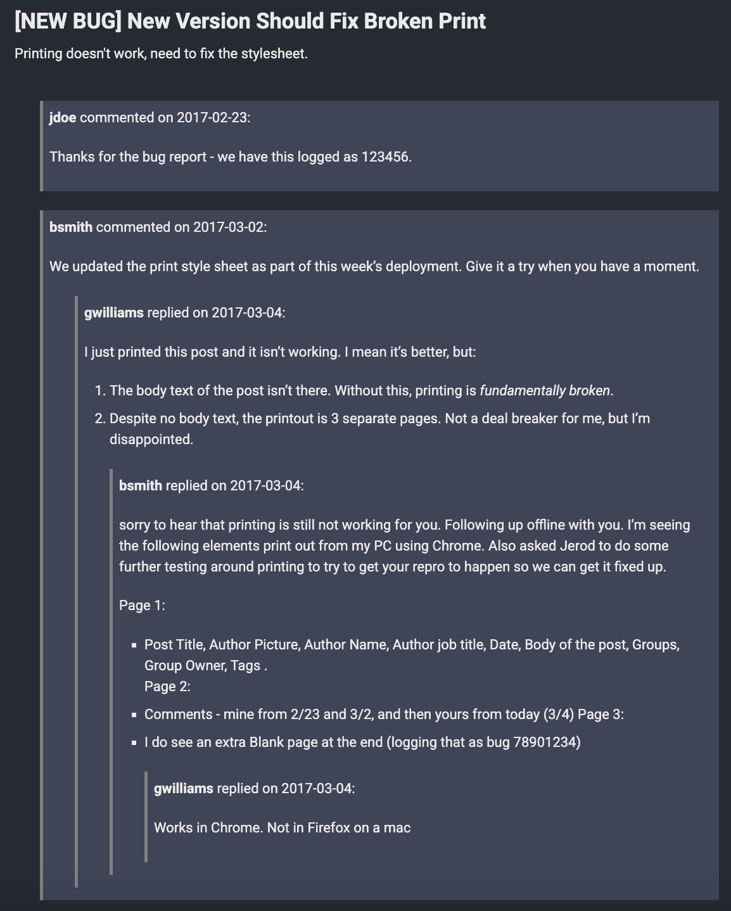

# Migrating Old Drupal Comments to Jekyll

The contents of this folder will help you migrate and display comments from Drupal 7 (and maybe Drupal 8, YMMV) into Jekyll.  Please note that this will only result in displaying old comments; If you need an interactive comments feature on your Jekyll site, consider adding a service such as [Disqus](https://disqus.com/).

## Prerequisites

1. You should have the ability to run queries against the source Drupal 7 database.  (You would need this anyway in order to use jekyll-import!)
2. You should have Python3 installed, or access to a Python virtual environment.
  1. You will need to install pyyaml like so: `pip install pyyaml`

## Instructions

1. Run `1-get-all-drupal-comments.sql` against the Drupal database.
2. Export all of those results into a file called `comments.csv`.  Place that file in the root of your Jekyll project.
3. In your Jekyll project's `_config.yml`, add this line: `data_dir: _data`.  If you already have a data_dir pointing somewhere else, you may need to modify the remaining scripts accordingly.
4. In the `_data` folder (or wherever your data_dir is), make a new folder called `comments`.
5. Run `2-generate-comments-yaml.py`, which will generate a `.yml` file for each post that has comments.  The name of the file is the node id of the post.
6. Run `3-find-max-comment-depth.py` to determine the max comment depth of each post, as well as the max depth across all posts.  This value will be important if, for reasons explained later, you cannot use recursion in your Liquid templates.
7. Now let's add some CSS to `assets/css/main.scss` to ensure our comments will look nice.  You can change this later as you see fit:
```
.archived-comment-ul {
  list-style-type: none;
}

.archived-comment-li {
  border-left: 5px gray solid;
  padding: 10px;
  margin: 30px 0 10px 0;
  background-color: #3e4459;
  list-style-type: none;
}
```
8. In your `_layouts/post.html` file (or wherever your post page is), add a section that looks like this toward the bottom.  You may need to change the HTML a bit to suit your needs.
```
<section class="page__content" itemprop="text">
  
  

  
    <ul class="archived-comment-ul">
      
        
      
    </ul>
  
    <p>No archived comments</p>
  
</section>
```
9. Add a file called in the `_includes` folder called `archived-comments.html`.  This file can be recursive if you are using Jekyll 4:
```
<li class="archived-comment-li" style="margin-left: {{ level | times: 20 }}px">
  <p><strong>{{ comment.name }}</strong> commented on {{ comment.date | date: "%Y-%m-%d" }}:</p>
  <div><p>{{ comment.body | markdownify }}</p></div>
  
  
  
    <ul class="archived-comment-ul">
      
      
        
      
    </ul>
  
</li>
```
However, if you're using Jekyll 3 or if you encounter a "Nesting too deep included" error, you will not be able to use recursion.  This means your `archived-comments.html` file will have to handle the maximum possible comment depth.  The following is an example that allows for a max depth of 3.  It's not ideal, but it is what it is:
```
<!-- LEVEL 0 START ------------------------------------------>
<li class="archived-comment-li">
  <p><strong>{{ comment0.name }}</strong> commented on {{ comment0.date | date: "%Y-%m-%d" }}:</p>
  <div><p>{{ comment0.body | markdownify }}</p></div>
  
  
  
    <ul class="archived-comment-ul">
      
        <!-- LEVEL 1 START ------------------------------------------>
        <li class="archived-comment-li">
          <p><strong>{{ replyTo0.name }}</strong> replied on {{ replyTo0.date | date: "%Y-%m-%d" }}:</p>
          <div><p>{{ replyTo0.body | markdownify }}</p></div>
          
          
          
            <ul class="archived-comment-ul">
              
                <!-- LEVEL 2 START ------------------------------------------>
                <li class="archived-comment-li">
                  <p><strong>{{ replyTo1.name }}</strong> replied on {{ replyTo1.date | date: "%Y-%m-%d" }}:</p>
                  <div><p>{{ replyTo1.body | markdownify }}</p></div>
                  <!-- ******* IF MAX DEPTH IS 3, SO WE DON'T NEED TO NEST FURTHER ******* -->
                </li>
                <!-- LEVEL 2 END -------------------------------------------->
              
            </ul>
          
        </li>
        <!-- LEVEL 1 END -------------------------------------------->
      
    </ul>
  
</li>
<!-- LEVEL 0 END -------------------------------------------->
```
10. Rebuild / serve the Jekyll site.  If all goes well, you'll end up with posts and comments that look something like this:
